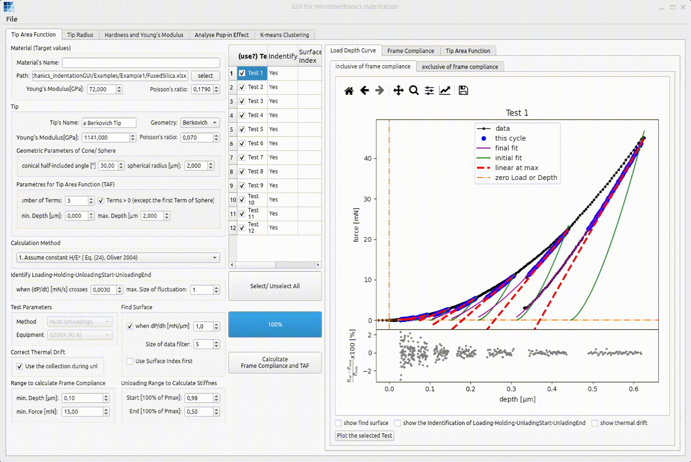
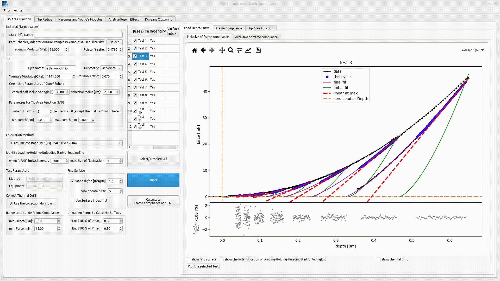
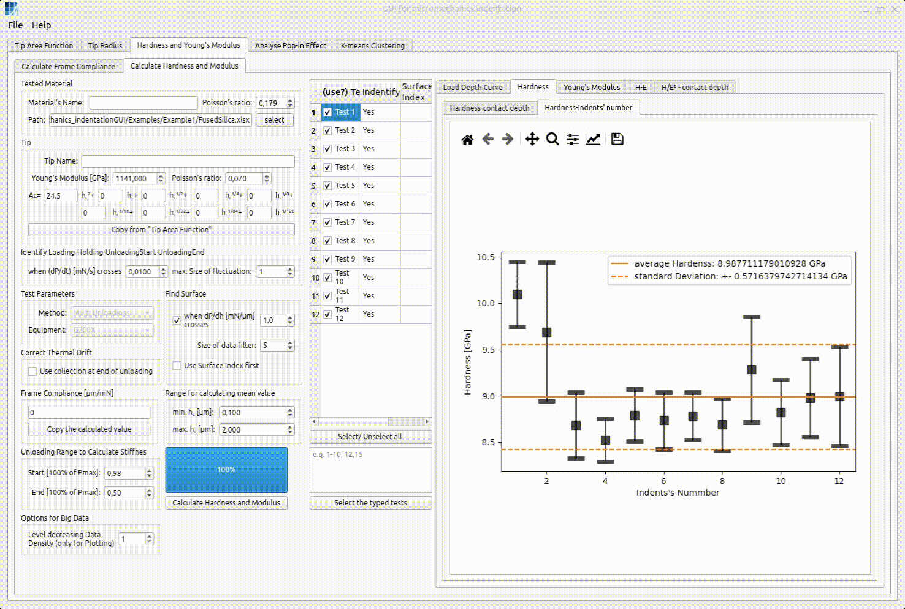

---
myst:
  html_meta:
    description: Frequently asked questions for micromechanics-indentationGUI, including test selection, load-depth plotting, and manual contact-surface selection.
---

# Frequently Asked Questions

## How can I highlight the test(s) to plot their load-depth curves?

The following three methods can be used.

1. Left click

   

2. Left click + `Ctrl`

   

3. Left click + `Shift`

   

## How can I manually set the contact surface for a certain test?

Move the mouse onto the data point to be selected and then right click.

## How can I select the test(s) for calculation?

The following three methods can be used.

1. Left click

   

2. Select or unselect all tests

   

3. Type the test number

   
